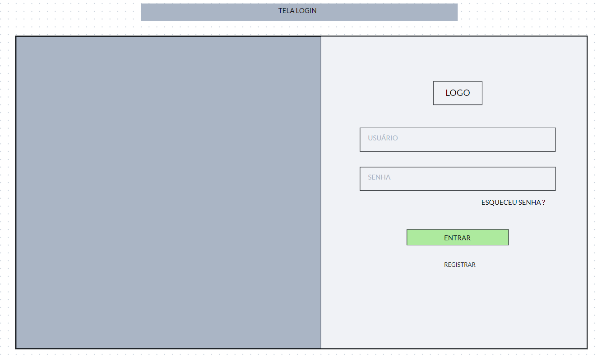
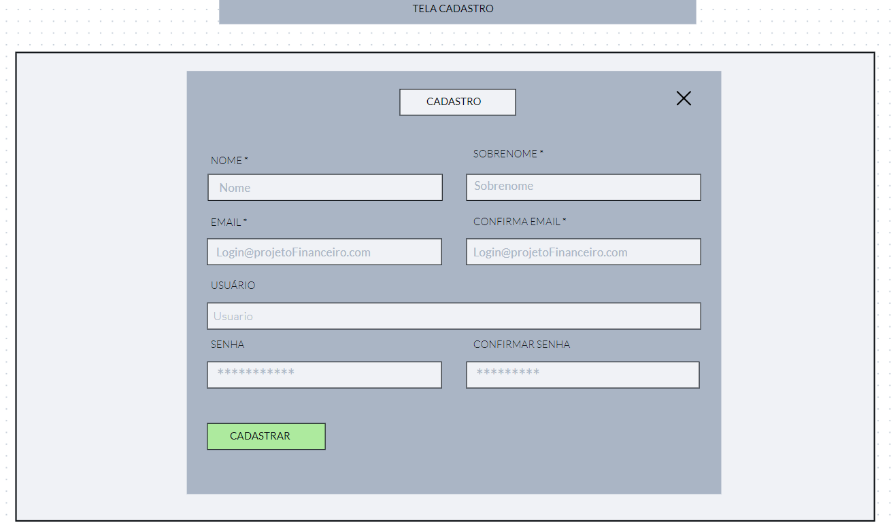
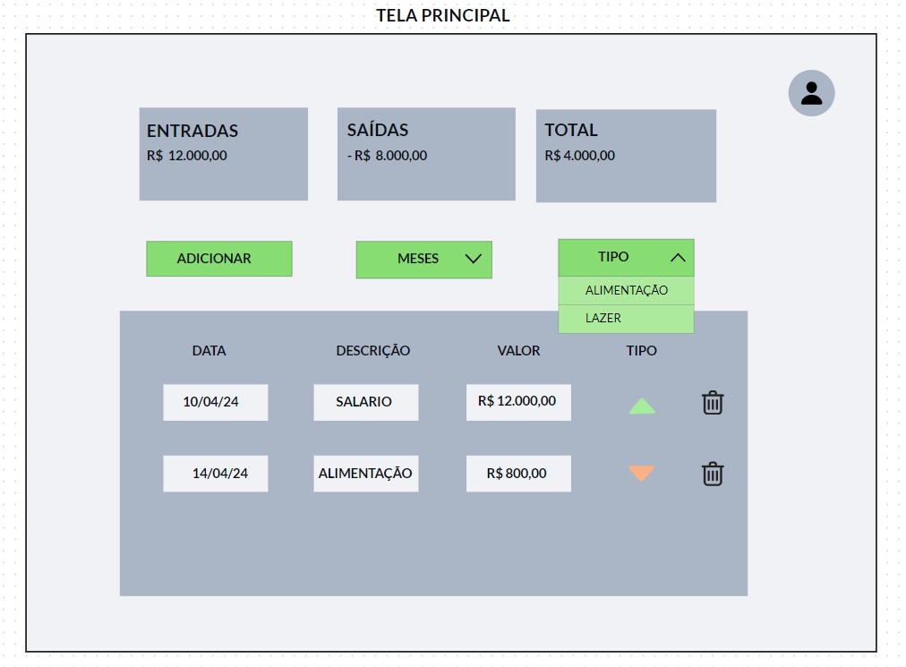
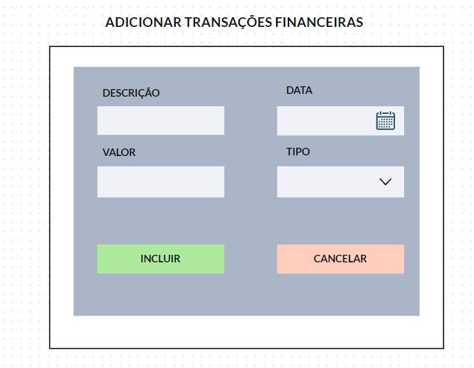
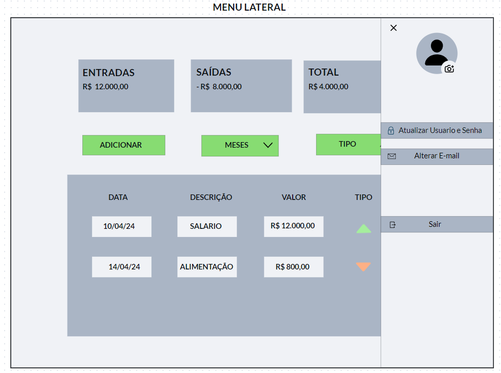
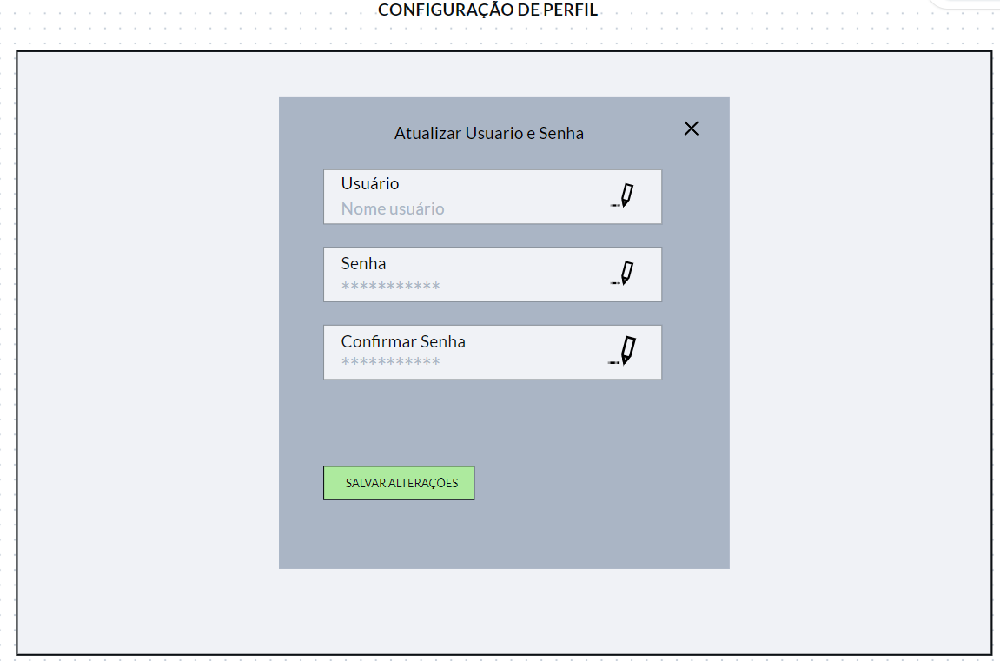
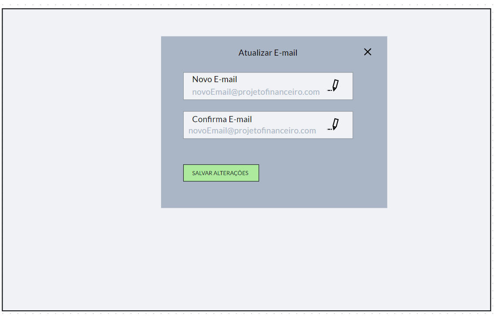

# Projeto de Interface

Visão geral da interação do usuário atráves das telas do sistema e protótipo interativo das funcionalidades que fazem parte do sistema (wireframes) para o projeto de controle financeiro.

Apresentação das principais interfaces da plataforma, demonstrando como elas foram elaboradas de forma a atender aos requisitos funcionais, não-funcionais e historia de usuários descritos na Especificação do projeto.

## User Flow

Fluxo de usuário (User Flow) é uma técnica que permite ao desenvolvedor mapear todo fluxo de navegação do usuário na aplicação. Essa técnica funciona para alinhar os caminhos e as possíveis ações que o usuário pode fazer junto com os membros de sua equipe.

[Adicione aqui o diagrama de fluxo de usuário da sua aplicação.]

> **Links Úteis**:
>
> - [User Flow: O Quê É e Como Fazer?](https://medium.com/7bits/fluxo-de-usu%C3%A1rio-user-flow-o-que-%C3%A9-como-fazer-79d965872534)
> - [User Flow vs Site Maps](http://designr.com.br/sitemap-e-user-flow-quais-as-diferencas-e-quando-usar-cada-um/)
> - [Top 25 User Flow Tools & Templates for Smooth](https://www.mockplus.com/blog/post/user-flow-tools)

## Wireframes

As telas descritas a seguir fazem parte de um sistema de controle financeiro, que permite ao usuário gerenciar suas finanças de formar organizada e eficiente.

 
<h3><ins> Tela de Login </ins></h3>
 

- **Tela de Login:** Esta é a primeira tela que o usuario ira se deparar antes de fato começar a usufruir das aplicações do sistema. Para isso, é necessario criar um usuario, inserindo suas informações de forma facil e segura. Após a criação poderá acessar as funcionalidades do sistema.

 

 
<h3><ins> Tela Cadastro </ins></h3>
 

- **Tela de Cadastro:** Nesta tela, como citado a cima é onde o usuário poderá criar sua conta em nossa aplicação, informando seu nome, email e senha a ser utilizada.

 

 
<h3><ins> Tela Principal </ins></h3>
 

- **Tela Principal:** Após o usuário entrar com seu login e senha, é esta a tela principal do usuário, é nesta tela que irá apresentar, cadastrar todas as transações financeiras.

 

 
<h3><ins> Tela Adicionar Transações Financeiras </ins></h3>
 

- **Tela de Adicionar gastos:** Nesta tela, é onde o usuário podera adicionar suas transações, inserindo o valor, data, descritivo e podendo adiconar tal lançamento em um grupo de gastos.

 

 
<h3><ins> Tela Menu Lateral </ins></h3>
 

- **Tela de Menu Lateral:** Nesta tela, demonstra o menu lateral contendo mais funcionalidades para o usuario, como atualização do perfil (alterando sua foto, usuario, senha e e-mail). Além disso, podera efetuar o logout do site.

 

 
<h3><ins> Tela de Configuração de Perfil  </ins></h3>
 

- **Tela de Configuração de perfil:** Nesta tela, o cliente será capaz de alterar seu nome de usuário e senha.

 

 
<h3><ins> Tela de atualização do E-mail </ins></h3>
 

- **Tela de Atualização de E-mail:** Nesta tela, o cliente poderá efetuar a atualização do email cadastrado.

 
