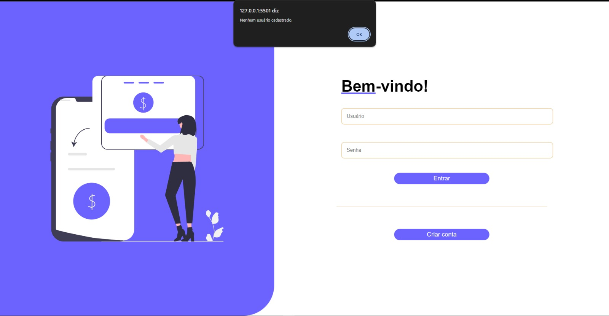
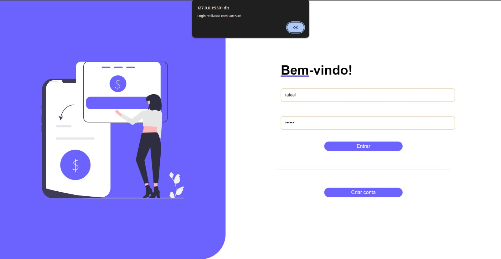

# Registro de testes de Software

Pré-requisitos: <a href="https://github.com/ICEI-PUC-Minas-PMV-ADS/pmv-ads-2024-1-e1-proj-web-t10-pmv-ads-2024-1-e1-proj-financeiro/blob/main/documentos/07-Plano_de_Testes_de_Software.md"> Plano de testes de Software</a>, <a href="https://github.com/ICEI-PUC-Minas-PMV-ADS/pmv-ads-2024-1-e1-proj-web-t10-pmv-ads-2024-1-e1-proj-financeiro/blob/main/documentos/04-Projeto_de_Interface.md"> Projeto de Interface</a>

Os testes funcionais realizados na aplicação web são descritos a seguir.

<ol>
  <li>CT-01: Verificar o cadastro de usuários.

Responsável: Yasmin Maia.

Usuário preenche os campos "Senha" e "Confirmaçāo de Senha" com valores diferentes.

<figure> 
  
  <figcaption> 
</figure>

Verificar se o registro do usuário foi bem sucedido.

<figure> 
  
  <figcaption> 
</figure>

Informações armazenadas no LocalStorage após usuário se cadastrar.

<figure> 
  
  <figcaption> 
</figure>

Tentativa de login sem usuário cadastrado.

<figure> 
  
  <figcaption> 
</figure>

Login realizado com sucesso após o cadasro do usuário.

<figure> 
  
  <figcaption> 
</figure>
</li>
